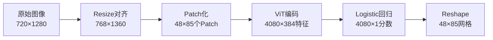
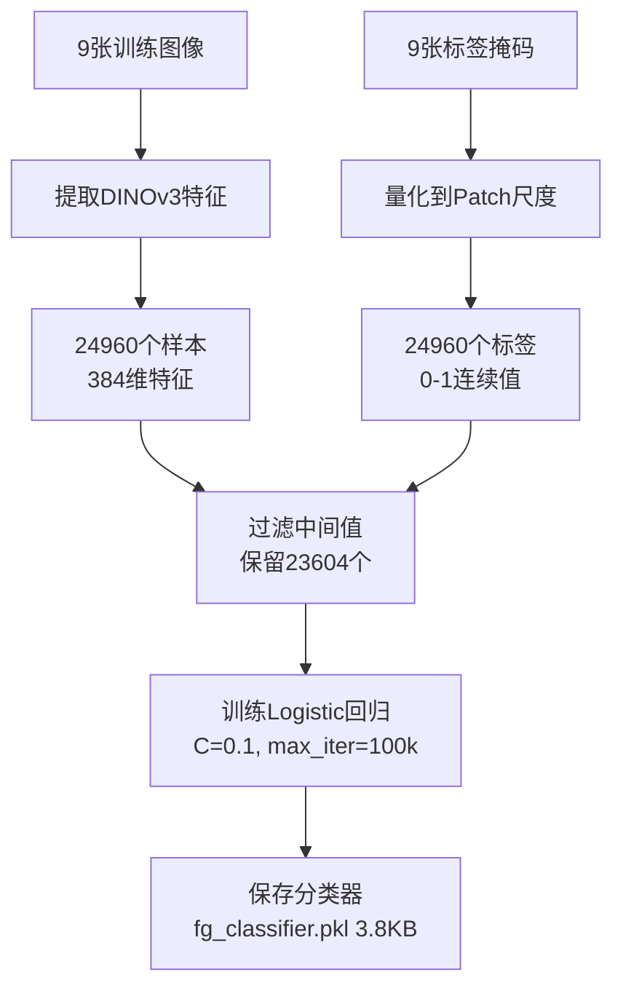
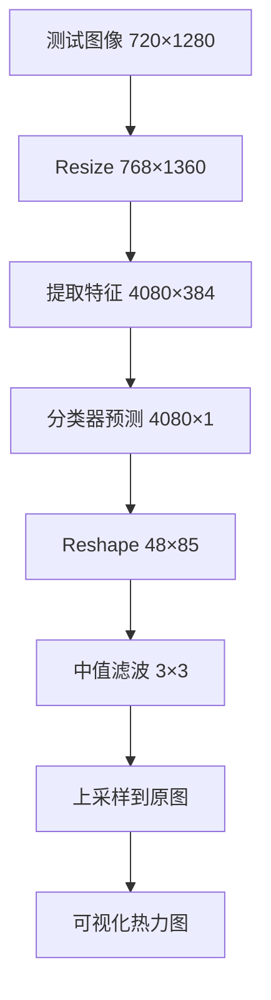

# DINOv3 前景分割训练详解

## 概述

本文档详细解析 DINOv3 前景分割训练过程中的关键技术细节，包括模型结构、数据处理、特征提取和后处理流程。

---

## 1. LogisticRegression 模型本质

### 1.1 模型结构

**核心：一个线性分类超平面**

对于 `dinov3_vits16` 提取的 384 维特征，Logistic 回归学习的是：
- 权重向量：$\mathbf{w} \in \mathbb{R}^{384}$
- 偏置项：$b \in \mathbb{R}$

### 1.2 数学原理

分类概率计算公式：

$$P(\text{foreground}) = \sigma(\mathbf{w} \cdot \mathbf{x} + b)$$

其中：
- $\mathbf{x}$：384 维特征向量（单个 Patch 的 DINOv3 特征）
- $\sigma$：Sigmoid 函数 $\sigma(z) = \frac{1}{1 + e^{-z}}$
- $\mathbf{w} \cdot \mathbf{x}$：向量点积

### 1.3 模型文件分析

**`fg_classifier.pkl` 为何只有 3.8KB？**

存储内容：
1. `coef_`：形状为 `(1, 384)` 的浮点数矩阵. 实测取值在[-0.75, 0.75]
2. `intercept_`：1 个浮点数
3. 元数据：类别标签、训练参数等

**文件大小计算**：
```
384 个权重 × 8 字节（float64） = 3,072 字节 ≈ 3 KB
+ 1 个偏置 × 8 字节 = 8 字节
+ pickle 元数据开销 ≈ 0.7 KB
────────────────────────────────────────
总计 ≈ 3.8 KB
```

### 1.4 训练参数

根据 [`scripts/foreground_segmentation.py:96`](scripts/foreground_segmentation.py:96)：

```python
LogisticRegression(random_state=0, C=0.1, max_iter=100000, verbose=1)
```

- `C=0.1`：L2 正则化强度（值越小正则化越强）
- `max_iter=100000`：最大迭代次数
- `random_state=0`：保证可复现性

---

## 2. 训练样本与过滤逻辑

### 2.1 样本的本质

**每个样本 = 图像中的一个 Patch**

- DINOv3 使用 **16×16 像素**的 Patch 作为基本单位
- 每个 Patch 经过 Vision Transformer 编码后得到 **384 维**的特征向量
- 训练样本 = 所有图像的所有 Patch 特征

### 2.2 样本数量计算

**实际运行日志**：
```
加载了 9 张图像
过滤前样本数: 24960
过滤后样本数: 23604
过滤掉样本数: 1356
```

**理论计算**（以测试图为例）：
- 原始图像：720 × 1280 像素
- 对齐后尺寸：768 × 1360 像素（对齐到 16 的倍数）
- Patch 网格：
  - $H_{\text{patches}} = 768 / 16 = 48$
  - $W_{\text{patches}} = 1360 / 16 = 85$
  - 单张图 Patch 数 = $48 \times 85 = 4080$
- 9 张图理论总数：$4080 \times 9 = 36720$

**日志差异原因**：
- 训练集中的图像尺寸可能不完全一致
- 平均每张图约产生 $24960 / 9 \approx 2773$ 个 Patch

### 2.3 过滤策略详解

#### 过滤代码分析

在 [`scripts/foreground_segmentation.py:75`](scripts/foreground_segmentation.py:75)：

```python
# 关键步骤: 过滤中间值
idx = (ys < 0.01) | (ys > 0.99)
xs = xs[idx]
ys = ys[idx]
```

#### 标签生成机制

1. **Ground Truth 处理**：
   - 原始标签是高分辨率的二值掩码（0 或 255）
   - 通过卷积量化到 Patch 尺度（见第 50-64 行）

2. **量化滤波器**：
```python
patch_quant_filter = torch.nn.Conv2d(1, 1, PATCH_SIZE, stride=PATCH_SIZE, bias=False)
patch_quant_filter.weight.data.fill_(1.0 / (PATCH_SIZE * PATCH_SIZE))
```
这是一个 **16×16 均值池化卷积**，将每个 Patch 区域的标签值取平均。

3. **标签值的含义**：
   - `0.00`：完全背景（Patch 内所有像素都是背景）
   - `1.00`：完全前景（Patch 内所有像素都是前景）
   - `0.50`：边缘 Patch（一半前景一半背景）

#### 为什么过滤中间值？

**核心思想：只用"纯净"样本训练**

| 标签范围 | 含义 | 是否保留 | 原因 |
|---------|------|---------|------|
| < 0.01 | 纯背景 | ✅ 保留 | 特征纯净，无歧义 |
| 0.01 - 0.99 | 边缘/混合 | ❌ 过滤 | 特征混合，干扰训练 |
| > 0.99 | 纯前景 | ✅ 保留 | 特征纯净，无歧义 |

**技术优势**：
1. **提高分类器鲁棒性**：避免学习模糊边界导致的噪声模式
2. **加速收敛**：清晰的样本让梯度下降更稳定
3. **提升泛化能力**：学到的是物体的"核心特征"而非边界细节

**是否"极端"？**
- 这不是极端，而是**硬样本挖掘**的逆操作（Easy Sample Mining）
- 在标注数据有限时，优先保证训练样本的质量而非数量
- 保留率：$23604 / 24960 \approx 94.6\%$，仍有足够样本

---

## 3. 特征维度变换流程

### 3.1 从图像到特征的完整流程



### 3.2 详细尺寸计算

#### Step 1: 图像对齐

**输入**：720 × 1280 像素（RGB）

**对齐规则**：必须是 Patch 大小（16）的整数倍

```python
# 对齐计算
H_aligned = ceil(720 / 16) * 16 = 45 * 16 = 720
W_aligned = ceil(1280 / 16) * 16 = 80 * 16 = 1280
```

**实际日志显示**：768 × 1360
- 可能使用了不同的对齐策略（如保持长宽比缩放）
- 或测试图与训练图尺寸不一致

#### Step 2: Patch 分割

**Patch 网格计算**：
```python
h_patches = 768 / 16 = 48
w_patches = 1360 / 16 = 85
total_patches = 48 * 85 = 4080
```

**每个 Patch**：
- 空间尺寸：16 × 16 像素
- 原始特征：16 × 16 × 3 = 768 维

#### Step 3: DINOv3 特征提取

**模型处理**：
- 输入：4080 个 Patch（每个 768 维）
- Vision Transformer 编码
- 输出：4080 个 384 维特征向量

**特征张量形状**：`(4080, 384)`

### 3.3 推理时的维度变换

根据 [`scripts/foreground_segmentation.py:184`](scripts/foreground_segmentation.py:184)：

```python
feats = extract_features(model, test_tensor, model_name)  # (4080, 384)
fg_score = clf.predict_proba(np.asarray(feats))[:, 1]     # (4080,)
fg_score = fg_score.reshape(h_patches, w_patches)         # (48, 85)
```

**维度变换表**：

| 步骤 | 操作 | 形状 |
|-----|------|------|
| 1 | 特征提取 | `(4080, 384)` |
| 2 | 预测概率 | `(4080, 2)` → 取 `[:, 1]` → `(4080,)` |
| 3 | Reshape 为网格 | `(48, 85)` |
| 4 | 中值滤波 | `(48, 85)` |
| 5 | 上采样到原图 | `(720, 1280)` |

---

## 4. 后处理操作详解

### 4.1 predict_proba 方法

**sklearn API 说明**：

```python
probabilities = clf.predict_proba(X)
# 返回: (n_samples, n_classes) 的概率矩阵
```

**在本项目中**：
- `X.shape = (4080, 384)`：4080 个 Patch 特征
- 返回 `(4080, 2)`：
  - 第 0 列：背景概率 $P(\text{background})$
  - 第 1 列：前景概率 $P(\text{foreground})$
- 取 `[:, 1]` 得到前景分数

**计算过程**：
$$
\begin{align}
z &= \mathbf{w} \cdot \mathbf{x} + b \\
P(\text{foreground}) &= \frac{1}{1 + e^{-z}}
\end{align}
$$

### 4.2 medfilt2d 中值滤波

**函数签名**：
```python
from scipy.signal import medfilt2d
filtered = medfilt2d(input, kernel_size=3)
```

#### 工作原理

**滑动窗口中值**：

```
原始概率图（部分区域）：        中值滤波后：
┌────────────────┐            ┌────────────────┐
│ 0.1  0.9  0.2 │            │ 0.1  0.2  0.2 │
│ 0.2  0.8  0.3 │  ──filter→ │ 0.2  0.3  0.3 │
│ 0.1  0.2  0.1 │            │ 0.1  0.2  0.1 │
└────────────────┘            └────────────────┘
```

**中心像素计算**（3×3 窗口）：
```python
window = [0.1, 0.9, 0.2, 0.2, 0.8, 0.3, 0.1, 0.2, 0.1]
sorted_window = [0.1, 0.1, 0.2, 0.2, 0.2, 0.3, 0.8, 0.9]
median = sorted_window[4] = 0.2  # 中位数
```

#### 效果对比

| 特性 | 均值滤波 | 中值滤波 |
|-----|---------|---------|
| 计算方式 | 窗口平均 | 窗口中位数 |
| 噪声处理 | 减弱但保留 | **完全消除** |
| 边缘保护 | 模糊边缘 | **保持锐利** |
| 孤立点 | 平滑衰减 | **直接移除** |

#### 应用场景

**消除"椒盐噪声"**：

```
滤波前（存在孤立误判）：        滤波后（平滑连续）：
┌────────────────────┐        ┌────────────────────┐
│ 🟦🟦🟦🟦🟦🟦🟦🟦 │        │ 🟦🟦🟦🟦🟦🟦🟦🟦 │
│ 🟦🟦🟥🟦🟦🟦🟦🟦 │ ──→   │ 🟦🟦🟦🟦🟦🟦🟦🟦 │
│ 🟦🟦🟦🟦🟥🟥🟥🟥 │        │ 🟦🟦🟦🟥🟥🟥🟥🟥 │
│ 🟦🟦🟦🟦🟥🟥🟥🟥 │        │ 🟦🟦🟦🟥🟥🟥🟥🟥 │
└────────────────────┘        └────────────────────┘
  ↑ 孤立的错误预测点               ↑ 被邻域投票修正
```

### 4.3 可视化流程

根据 [`scripts/foreground_segmentation.py:115-138`](scripts/foreground_segmentation.py:115)：

```python
def visualize_result(image, fg_score, save_path):
    # 1. 上采样到原图尺寸
    heatmap = cv2.resize(fg_score, (img_width, img_height))
    
    # 2. 归一化到 [0, 1]
    heatmap = np.clip(heatmap, 0, 1)
    
    # 3. 应用颜色映射（JET热力图）
    heatmap_colored = cv2.applyColorMap(
        (heatmap * 255).astype(np.uint8), 
        cv2.COLORMAP_JET
    )
    
    # 4. 叠加到原图
    overlay = cv2.addWeighted(img_bgr, 0.6, heatmap_colored, 0.4, 0)
```

**JET 颜色映射**：
- 蓝色 → 青色 → 绿色 → 黄色 → 红色
- 对应分数：0.0 → 0.25 → 0.5 → 0.75 → 1.0

---

## 5. 完整流程总结

### 5.1 训练阶段



### 5.2 推理阶段



### 5.3 关键技术亮点

1. **特征提取**：
   - 利用 DINOv3 预训练模型的强大表征能力
   - 无需微调，直接使用冻结特征

2. **训练策略**：
   - 样本过滤：只用高置信度样本（94.6% 保留率）
   - 轻量分类器：仅 3.8KB 的线性模型

3. **后处理**：
   - 中值滤波：消除噪声，保持边缘
   - 热力图可视化：直观展示分割结果

4. **效率优势**：
   - 9 张图训练即可达到 99.41% 训练准确率
   - 平均精度（AP）0.9993
   - 推理速度快（无复杂计算图）

---

## 6. 实验结果

### 6.1 训练指标

```
训练数据形状: X=(23604, 384), y=(23604,)
正样本比例: 26.50%
训练准确率: 99.41%
平均精度(AP): 0.9993
```

### 6.2 样本分布

| 类别 | 数量 | 比例 |
|-----|------|------|
| 背景 | 17,350 | 73.50% |
| 前景 | 6,254 | 26.50% |
| 总计 | 23,604 | 100% |

### 6.3 过滤效果

- 原始样本：24,960
- 过滤后：23,604
- 过滤率：5.4%（移除边缘模糊 Patch）

---

## 7. 代码实现参考

### 7.1 核心文件

- [`scripts/foreground_segmentation.py`](../scripts/foreground_segmentation.py)：主训练脚本
- [`scripts/dinov3_utils.py`](../scripts/dinov3_utils.py)：模型加载和特征提取工具
- [`run.sh`](../run.sh)：启动脚本

### 7.2 关键函数

| 函数 | 行号 | 功能 |
|-----|------|------|
| `prepare_training_data` | 43-87 | 提取特征并过滤样本 |
| `train_classifier` | 90-102 | 训练 Logistic 回归 |
| `evaluate_classifier` | 105-112 | 计算 AP 指标 |
| `visualize_result` | 115-138 | 生成可视化结果 |

---

## 8. 深度原理解析：为什么 Patch 具有前景识别能力？

### 8.1 自注意力机制 (Self-Attention) 的“全局视野”
虽然 Patch 是被切开输入的，但在进入 `LogisticRegression` 之前，它们已经通过了 DINOv3 的多层 **Transformer Block**。

*   **并非独立处理**：在 Transformer 内部，每个 Patch 都会与图像中的**所有其他 Patch** 进行交互（计算注意力）。
*   **上下文编码**：当模型提取第 $i$ 个 Patch 的 384 维特征时，这个特征向量已经通过自注意力机制整合了全图的信息。例如，一个位于边缘的“草地” Patch，其特征中会包含“周围是草地”以及“远处有显著物体”的上下文信息。
*   **位置编码 (Positional Embeddings)**：模型在输入时为每个 Patch 注入了位置信息，使特征向量“知道”自己在全局中的坐标。

### 8.2 DINOv3 预训练的语义聚类能力
DINO 系列模型通过自监督学习，在特征空间中实现了极强的语义聚集性：

*   **物体一致性**：训练目标强制要求同一物体的不同视图具有相似特征，使模型能自动发现物体边界。
*   **线性可分性**：在 384 维空间中，“属于物体的 Patch”和“属于背景的 Patch”自然地分布在不同的区域。
*   **线性分类器的作用**：`LogisticRegression` 实际上是在这个高维语义空间中寻找一个**超平面**。它不需要知道 Patch 的像素坐标，只需根据 384 维向量的“特征模式”即可判定其是否属于前景。

### 8.3 局部特征的语义强度
即使是不包含完整物体的 Patch（如物体局部或纯背景），其特征也具有高度区分度：
*   **特征差异**：属于“物体局部”的特征与属于“背景环境”的特征在数学分布上差异巨大。
*   **前景定义**：在此任务中，前景被定义为“具有显著语义特征的物体”。线性模型学到的正是这种从 DINOv3 提取出的、已经过全局建模的特征模式差异。

---

## 9. 常见问题

### Q1: 为什么不用深度模型如 U-Net？

**A**: 
- DINOv3 特征已经包含丰富的语义信息
- 线性模型足以在特征空间中找到分类超平面
- 3.8KB 模型 vs 数十 MB 的深度网络，效率极高

### Q2: 过滤 5.4% 的样本会损失信息吗？

**A**:
- 过滤的是**边缘模糊**的 Patch，不是完整的图像
- 物体的核心特征仍然保留
- 类似于"困难样本挖掘"的反向操作

### Q3: 中值滤波会破坏分割精度吗？

**A**:
- 3×3 窗口只平滑孤立噪声点
- 边缘锐利度得到保护（相比高斯滤波）
- 可以通过调整 `kernel_size` 控制平滑程度

### Q4: 如何提升模型性能？

**改进方向**：
1. 增加训练样本多样性
2. 尝试更大的 DINOv3 模型（如 vitl16）
3. 调整正则化参数 `C`
4. 使用条件随机场（CRF）替代中值滤波

---

## 9. 参考资料

- DINOv3 论文: [arXiv:2304.07193](https://arxiv.org/abs/2304.07193)
- Logistic 回归理论: [sklearn 文档](https://scikit-learn.org/stable/modules/linear_model.html#logistic-regression)
- 中值滤波原理: [scipy.signal.medfilt2d](https://docs.scipy.org/doc/scipy/reference/generated/scipy.signal.medfilt2d.html)

---

**文档更新时间**: 2026-02-14  
**对应代码版本**: dinov3 项目根目录
